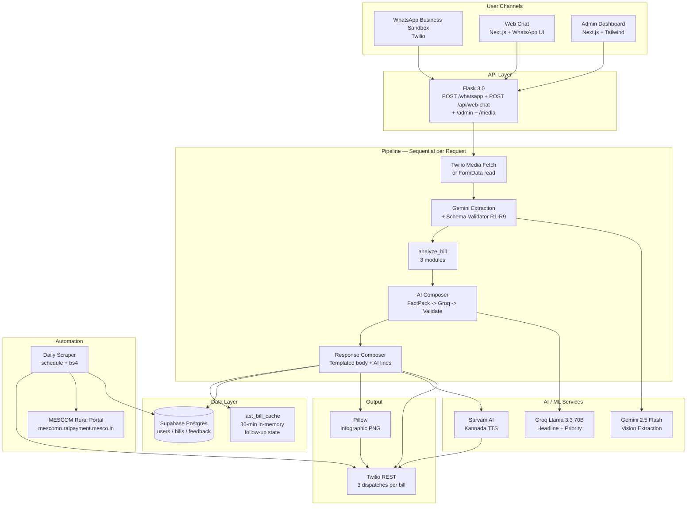

# VidyutMitra

**WhatsApp-First AI Energy Advisor for MESCOM Consumers**

Voice-First (Kannada) | Zero Literacy Required | DPDPA-Compliant | One Photo, Full Analysis

> **Paetrix Hackathon 2026** — Continuation of Hackfest'26 Sustainable Development track

---

## The Problem

**22.6 lakh** MESCOM households in coastal Karnataka pay an electricity bill every month — and most have no idea they're losing money to traps the bill itself doesn't explain.

| Trap | Reality |
|---|---|
| Fixed Charge over-provisioning | Consumers pay for kW they never draw — typical: Rs. 1,740/year wasted |
| Gruha Jyothi cliffs | 3 separate cliffs (entitlement, 200-cap, 10-month avg). Most beneficiaries only know one. One hot week → Rs. 1,500+ surprise bill |
| PM Surya Ghar awareness | 3 kW solar = Rs. 78,000 subsidy + 3.8-year payback. Most LT-1 consumers don't know they qualify |
| Bill comprehension | KERC tariff order is 47 pages. Bills mix Kannada/English. Many consumers can't read either fluently |

At MESCOM scale, even a 10% Fixed Charge over-provisioning rate = **Rs. 39 crore/year** flowing out of household pockets unnecessarily. The trap isn't the loss per family — it's that millions don't know it exists.

## The Solution

VidyutMitra ("Energy Friend") is a WhatsApp-first AI advisor. A user sends one photo of their MESCOM bill — the system extracts every field, runs three independent analyses, and replies in 10–15 seconds with a personalized text report, a Kannada voice note, and a printable infographic. **Zero typing, zero app install, zero literacy required.**

### Core Innovation: Triple Analysis Per Bill

Every bill runs through three deterministic analysis modules in parallel before being framed by an LLM:

| Module | Fires | What It Catches |
|---|---|---|
| **Tariff Engine** | Always | Bill arithmetic verification + Fixed Charge Trap detection |
| **Subsidy Navigator** | Always | PM Surya Ghar eligibility, Gruha Jyothi visibility (3-cliff warnings), Solar Water Heater rebate |
| **Solar ROI Calculator** | Always | System sizing, payback months, 25-year savings, CO2 offset, scale framing |

The math is 100% deterministic in Python. AI is used **only** to generate two personalized lines per response — a contextual headline and a priority CTA — using the analysis output as a fact-pack. Numbers from the analysis are guaranteed to appear verbatim in the output, validated by a regex sanity check before send.

### The Four Zeros

| Principle | How |
|---|---|
| **Zero Literacy** | Kannada voice note via Sarvam TTS + emoji-anchored text + printable infographic |
| **Zero App Download** | WhatsApp Sandbox only — bill arrives as a media message, response goes back as 3 messages (text + voice + image) |
| **Zero Bill Image Stored** | DPDPA Rule 2 compliance — image bytes live in a Python `bytes` variable for the duration of one Gemini call, then go out of scope. The `bills` table has no `bill_image` column by design |
| **Zero Typing for Followups** | Reply `SOLAR` / `FIXED` / `SUBSIDY` / `CLIFF` for two-turn drilldowns, all from the cached analysis |

## Architecture



### Deliberate Architectural Decisions

| Decision | Choice | Why Not Alternative |
|---|---|---|
| **Vision Extraction** | Gemini 2.5 Flash | Pro is 6–12s and 5–10x cost; Flash hits the §6 latency budget on the happy path |
| **AI Framing** | Groq Llama 3.3 70B | LPU-backed inference at ~700ms TTFT; 30 RPM free tier covers hackathon. Gemini for tone-only would double the latency |
| **Math Determinism** | Python in `analysis/` | LLMs hallucinate KERC constants — we pinned every tariff in `tariff_constants.py`, so AI can never write `0.727 kg/kWh` (stale CO2) or `LT-2(a)` (wrong code) |
| **AI Validator** | Regex against fact-pack | Every numeric token in the AI output must appear verbatim in the FactPack JSON. Hallucinations are silently dropped, falling back to template |
| **Database** | Supabase Postgres | Hosted Postgres + REST out-of-the-box; free tier covers hackathon. Self-hosted Postgres adds ops overhead |
| **TTS** | Sarvam (Kannada-native) | Google TTS pronounces Kannada with English-speaker phonetics; Sarvam's `neha` voice is native |
| **Webhook Async Strategy** | Daemon thread + immediate TwiML ack | Twilio's 15s webhook timeout vs our 12s pipeline budget — async dispatch via Twilio REST gives us headroom |
| **Image Storage** | NEVER | DPDPA Rule 2 — `bills` schema deliberately omits `bill_image` for auditability |
| **Web Chat Endpoint** | Shared core, two thin endpoints | `/whatsapp` and `/api/web-chat` both call `compose_for_result_ai`; web is sync (returns JSON), WhatsApp is async (Twilio dispatch). Zero pipeline duplication |

### Cost Analysis

| Component | Per-bill cost | Notes |
|---|---|---|
| Gemini 2.5 Flash (vision) | ~$0.001 | One call per bill, plus ~30% retry rate on bad photos |
| Groq Llama 3.3 70B (AI compose) | ~$0.0006 | Single call generating ~150 output tokens |
| Sarvam Kannada TTS | ~Rs. 1.5 | One synthesis per bill (~600 chars input) |
| Supabase | Free tier | <500 MB, well within limits at hackathon scale |
| Twilio Sandbox | Free | Capped at 50 outbound msgs/day |
| Hosting (ngrok / Railway) | $0–$5/mo | Free ngrok for dev; Railway for prod tunnel |
| **Per-bill total** | **~Rs. 1.7** | At MESCOM scale (22.6 lakh consumers × 1 bill/mo) → **~Rs. 38 lakh/month**, against Rs. 39 crore/year savings — 100x ROI |

### External Services

| Service | Role |
|---|---|
| Google Gemini 2.5 Flash | Multimodal vision extraction of MESCOM bill fields → JSON |
| Groq Cloud (Llama 3.3 70B Versatile) | AI tone framing — personalized headline + priority CTA per bill |
| Sarvam AI (Bulbul-v2) | Neural TTS in Kannada with native pronunciation |
| Supabase | Hosted Postgres (users / bills / feedback) with row-level access via service key |
| Twilio WhatsApp Sandbox | Inbound media + outbound text/voice/image dispatches |
| MESCOM Rural Portal | Daily-scrape source for due-amount reminders |
| ngrok | Local dev tunnel for Twilio webhook → Flask |

### Internal Modules

| module | role |
|---|---|
| `extraction/` | Gemini client, schema validator (R1–R9), retry pipeline, demo fallbacks |
| `analysis/` | Tariff Engine (FCT detection), Subsidy Navigator (PMSG/GJ/SWH), Solar ROI, Climate Context, Load Inference |
| `output/` | Response composer (GJ + non-GJ + 4 follow-ups), AI composer (FactPack + Groq + validator), Kannada TTS, infographic renderer, Twilio dispatcher |
| `consent/` | DPDPA-compliant consent gate (START/STOP/LANG), language detection + persistence |
| `db/` | Supabase client (init + get_or_create_user + write_bill + write_feedback + set_account_id) |
| `automation/` | Daily MESCOM rural-portal scraper + Twilio reminder dispatch |
| `admin_api.py` | Next.js based admin dashboard endpoints |

## Quick Start

### Prerequisites

- Python 3.12+
- Node.js 20+ (for the dashboard / web chat)
- A `.env` file with API keys (see `backend/.env.example`)
- Supabase project with `backend/db/schema.sql` applied
- ngrok account (free tier) for the Twilio webhook tunnel

### Required environment variables

```bash
GEMINI_API_KEY=...           # Google AI Studio
GROQ_API_KEY=...             # Groq Cloud (free 30 RPM tier)
SARVAM_API_KEY=...           # sarvam.ai
TWILIO_ACCOUNT_SID=...
TWILIO_AUTH_TOKEN=...
TWILIO_WHATSAPP_NUMBER=whatsapp:+14155238886
SUPABASE_URL=https://<ref>.supabase.co
SUPABASE_KEY=...             # service role key
PUBLIC_BASE_URL=https://<your-ngrok-domain>.ngrok-free.dev
ADMIN_PASSWORD=...           # admin dashboard
FLASK_ENV=development
```

### Deploy Backend

```bash
# Python venv
python -m venv .venv
source .venv/bin/activate    # Windows: .venv\Scripts\activate

# Install dependencies
pip install -r backend/requirements.txt

# Initialize Supabase schema (prints SQL to paste into the SQL editor)
python backend/scripts/init_supabase.py

# Run Flask (debug off so daemon threads survive)
python -c "from backend.app import create_app; create_app().run(host='0.0.0.0', port=5001, use_reloader=False)"

# In a second terminal — open ngrok tunnel
ngrok http 5001 --domain=<your-stable-domain>.ngrok-free.dev
```

Then configure your Twilio Sandbox webhook to `https://<ngrok-domain>/whatsapp`.

### Deploy Frontend (Web Chat + Admin Dashboard)

```bash
cd vidyut-dashboard
npm install
npm run dev    # http://localhost:3000/chat
```

### Test the WhatsApp flow

```
You:        join <sandbox-code>     → Twilio Sandbox
You:        START                    → Consent persisted in Supabase
You:        ACCOUNT                  → "Reply with your RR Number..."
You:        RR123456                 → Linked to your phone for daily reminders
You:        [photo of MESCOM bill]   → Bill processed in ~12 sec
WhatsApp:   📊 Bill Report (text)
            🎙️ Kannada voice note
            🖼️ Infographic
            "Reply FEEDBACK or F to share thoughts"
You:        FIXED                    → Personalized fixed-charge drilldown
```

### Test the Web Chat flow (no Twilio quota cost)

```
1. Browser:  http://localhost:3000/chat
2. Type:     hi → consent prompt
3. Type:     START
4. Click:    📎 paperclip → upload bill photo
5. Wait:     ~12 sec for the synchronous response
6. Receive:  text bubbles + audio player + image bubble
```

### Run Tests

```bash
# Smoke suite (excludes integration tests that hit live services)
pytest backend/tests/ -m "not integration and not slow" -q

# Persona tests (Nikhil / Sunita / Priya — load-bearing for the demo)
pytest backend/tests/test_personas.py -v

# AI composer tests (validator, fallback, factpack shape)
pytest backend/tests/test_ai_composer.py -v
```

### Demo Mode

The system supports demo fallbacks (`backend/demo_fallbacks.json`) — when a known demo phone number sends a bill and Gemini fails (rate limit, API error), the system uses a cached extraction so the demo path stays green. Real users still hit Gemini live.

The three personas have hardcoded inputs and verified expected outputs:

| Persona | Profile | Expected Outcome |
|---|---|---|
| **Nikhil Shetty** | 210 units, 3 kW non-GJ, Surathkal | FCT fires, Rs. 1,740/yr trap, solar payback 3.8 yr |
| **Sunita Bhat** | 280 units, 3 kW non-GJ, Chikmagalur | FCT fires, faster solar payback ~3.2 yr |
| **Priya Nayak** | 110 units, 2 kW GJ-enrolled, Manipal | Net Rs. 0, but RED-zone warning — 5 units from soft step |

## Project Structure

```
vidyut-mitra/
  backend/
    app.py                        # Flask routes (whatsapp + web-chat + admin)
    extraction/                   # Gemini client, prompts, validator (R1–R9), pipeline
    analysis/                     # Tariff engine, subsidy navigator, solar ROI, climate
    output/                       # Response composer, AI composer (Groq), TTS, infographic
    consent/                      # DPDPA consent gate, language detection
    db/                           # Supabase client, schema.sql
    automation/                   # Daily MESCOM scraper + scheduler
    config/                       # Tariff constants, persona definitions
    tests/                        # 110+ tests; persona suite is the demo safety net
    scripts/                      # init_supabase, seed_demo_data, clean_demo_data
    demo_fallbacks.json           # Cached extractions for known demo phones
    requirements.txt
  vidyut-dashboard/
    app/
      page.tsx                    # Admin dashboard
      chat/page.tsx               # WhatsApp-style web chat client
    components/                   # React components
  docs/                           # briefing_v4, prd_v3, tech_spec_v1_1, reconciliation
  sample_bills/                   # Test images (gitignored except README)
  CLAUDE.md                       # Build context + non-negotiable rules
```

## Security & Privacy

- **DPDPA 2023 compliant**: bill image bytes never written to disk; `bills` schema has no image column; STOP command hard-deletes user + cascades bill rows
- **Consent gate**: every inbound message passes through `check_consent` before any media fetch or LLM call
- **No persistence of secrets**: API keys live in `.env` (gitignored); never committed
- **Aadhaar-style data minimization**: only fields needed for analysis are extracted from the bill — no name correlation, no address geocoding
- **Supabase row isolation**: phone-number-keyed access; service role key only on server side
- **AI hallucination guard**: every AI-generated message is regex-validated against the FactPack before send; any non-verbatim number triggers a silent fallback to the templated response
- **Rule 1 enforcement**: tests assert `ENERGY_CHARGE_FLAT_RATE == 5.80` and `GRID_CO2_FACTOR == 0.710` — stale or hallucinated constants would break the smoke suite

## Impact

| SDG | Contribution |
|---|---|
| **SDG 7 — Affordable & Clean Energy** | Surfaces PM Surya Ghar eligibility + payback math to MESCOM consumers in a language they speak |
| **SDG 10 — Reduced Inequalities** | Voice-first Kannada output makes the analysis accessible to consumers regardless of literacy |
| **SDG 12 — Responsible Consumption** | Fixed Charge Trap detection saves households Rs. 1,740/year on average — at MESCOM scale, Rs. 39 crore/year |
| **SDG 13 — Climate Action** | Solar ROI calculator reframes 2.98 tonnes/year CO2 offset in concrete terms (cars off road, trees planted equivalent) |
| **SDG 16 — Strong Institutions** | Daily MESCOM scraper + Gruha Jyothi cliff visibility makes opaque scheme mechanics legible to beneficiaries |

## Team

**Paetrix** — VidyutMitra Team

## License

MIT
